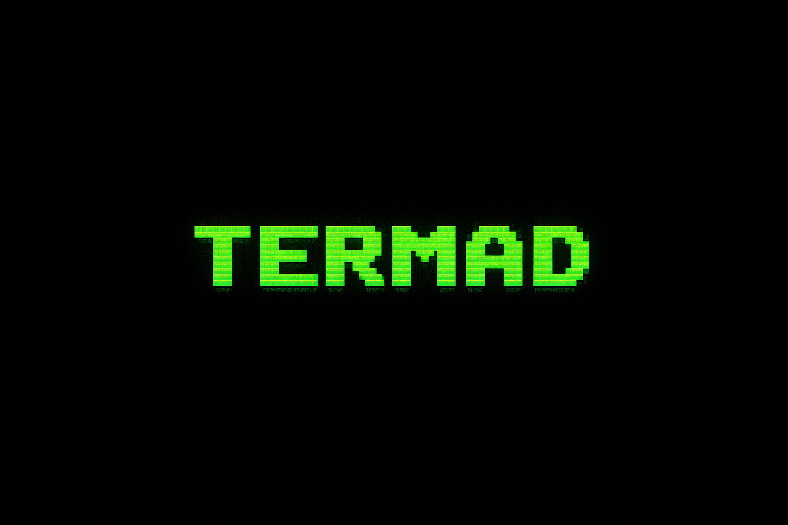
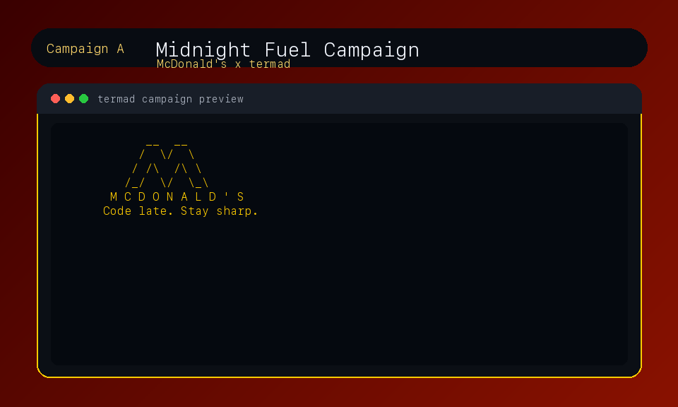
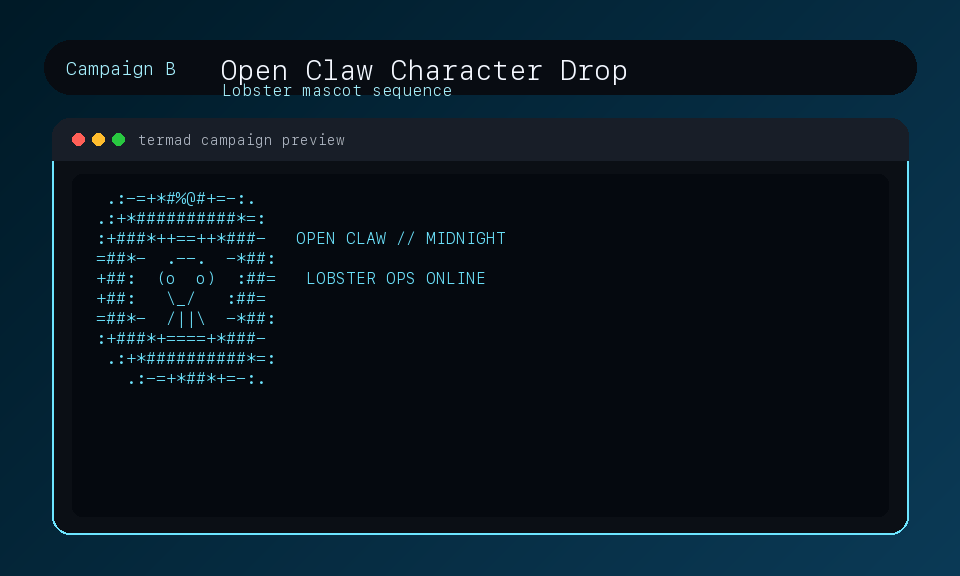
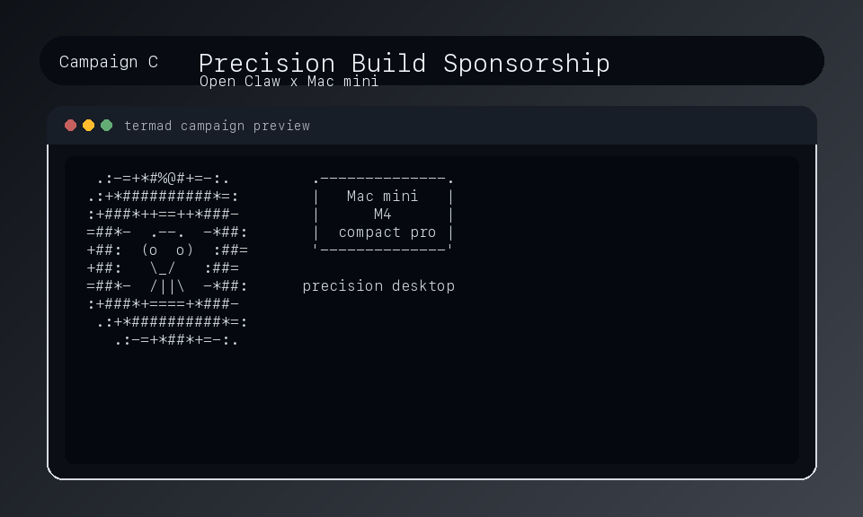

# termad

<p align="center">
  <b>Idle-time ad engine for CLI apps</b><br/>
  <i>When your terminal waits, your brand performs.</i>
</p>

<p align="center">
  <a href="#campaign-showcase">Campaign Showcase</a>
  ·
  <a href="#install">Install</a>
  ·
  <a href="#public-api">API</a>
  ·
  <a href="#demo-cli">Demo</a>
</p>

**Status:** Alpha (`v0.1.0-alpha.1`, package version `0.1.0a1`)

> "If your terminal is waiting anyway, it might as well do something useful."
> "如果你的终端反正都在等，不如让它做点有用的事。"

`termad` is for CLI tools that have quiet moments.
When your user stops typing for a bit, it shows an ASCII ad animation right inside the same terminal, then disappears cleanly on any keypress.
`termad` 是给 CLI 工具用的：当工具出现短暂“空档”时，它可以在同一个终端里播放 ASCII 广告动画，用户按任意键就会干净退出并恢复终端。

In plain words: it is a tiny "idle screensaver ad" engine for terminal apps, without opening extra windows or hijacking your normal I/O flow.
一句话：它是一个给终端应用用的“空闲屏保广告”小引擎，不会打开新窗口，也不会劫持你正常的输入输出流程。

## Why this feels pro

- Native terminal shell look: no browser tab, no popup window.
- Instant enter/exit: show on idle, dismiss on any keypress.
- Campaign-ready assets: plug in sponsor creatives as ASCII frame sequences.
- Creator-friendly storytelling: logo -> product -> slogan -> CTA.

## Campaign Showcase

<table>
  <tr>
    <td width="33%">
      
      <br />
      <b>McDonald's Midnight Fuel</b>
      <br />
      Logo + fries + burger + late-night CTA, designed for coding-after-dark sessions.
      <br />
      Asset: <code>termad/assets/mcd_night_ad.json</code>
    </td>
    <td width="33%">
      
      <br />
      <b>Open Claw Lobster Persona</b>
      <br />
      Character-led brand identity sequence for memorable terminal presence.
      <br />
      Asset: <code>termad/assets/open_claw_macmini_ad.json</code>
    </td>
    <td width="33%">
      
      <br />
      <b>Mac mini Precision Sponsor</b>
      <br />
      Hardware sponsorship-style frame set focused on performance and quiet power.
      <br />
      Asset: <code>termad/assets/open_claw_macmini_ad.json</code>
    </td>
  </tr>
</table>

## Sponsorship / 广告合作

**EN**  
Want to run ads in developer terminals? You can sponsor a campaign with termad and distribute it through our ad-network style integration. We support campaign onboarding, creative integration, and multi-project ad distribution with revenue-share options.

**中文**  
想投放开发者终端广告？可以通过 termad 发起赞助投放，并接入我们的广告联盟分发能力。支持广告创意接入、投放上线，以及跨项目分发与分成合作。

### Available Sponsor Slots / 可投放板位

| Slot / 板位 | Format / 形式 | Placement / 位置 | Suitable For / 适合品牌 |
| --- | --- | --- | --- |
| Hero Idle Slot | 6-20s animated ASCII | Main idle trigger in demo and CLI waiting scenes | Consumer brands, food & beverage, lifestyle |
| Character Story Slot | Multi-frame mascot sequence | Persona-led campaign block | IP brands, games, community campaigns |
| Hardware Sponsor Slot | Product-focused storyboard | Performance/dev-tool themed scenes | Hardware, cloud infra, dev tooling |

### Contact / 联系方式

- GitHub: [@Wendell-Guan](https://github.com/Wendell-Guan)
- Open an issue with title: `[Sponsorship] Brand Name - Campaign Idea`
- Include: target audience, campaign message, landing URL, expected run window

## Demo Commands for Campaign Content

Run these to recreate the branded terminal-ad feeling:

```bash
# McDonald's sequence
python examples/demo_claude_code.py

# Lobster + Mac mini sequence
python examples/demo_open_claw.py

# Core engine behavior (DVD-style default ad)
python examples/demo_cli.py
```

## Support and Limitations

- Primary runtime target: macOS terminal environments.
- Best tested in interactive TTY sessions (Terminal.app / iTerm2).
- If `stdin`/`stdout` are not TTYs, `termad` intentionally runs in safe no-op mode.
- Alpha caveat: API and behavior may evolve while hardening the SDK.

## Install

```bash
pip install termad
```

For local development in this repo:

```bash
pip install -e '.[dev]'
```

## Public API

```python
import termad

# Minimal integration
termad.init(idle_seconds=30)

# Load a custom ad
termad.load_ad("path/to/ad.json")

# Manually trigger (for testing)
termad.show_now()

# Stop monitoring
termad.stop()
```

### API notes

- `init(idle_seconds=30)` is idempotent.
- Calling `init(...)` again updates configuration and refreshes the idle timer.
- `load_ad(...)` accepts either:
  - a JSON file path (`str`), or
  - an in-memory Python `dict`.
- `stop()` is safe to call multiple times.

## Ad Format

Ads must provide these fields:

- `frames`: list of multi-line ASCII strings
- `frame_rate`: frames per second (`> 0`)
- `duration`: max display seconds before auto-dismiss (`> 0`)
- `metadata`: object containing:
  - `advertiser` (string)
  - `url` (string)

Example:

```json
{
  "frames": [
    "line 1\nline 2"
  ],
  "frame_rate": 12,
  "duration": 10,
  "metadata": {
    "advertiser": "ACME",
    "url": "https://example.com"
  }
}
```

Validation failures raise `ValueError` with explicit messages.

## Built-in Example Ad

Bundled at `termad/assets/dvd_ad.json`:

- Bouncing logo behavior (DVD-style diagonal motion).
- Edge collision on all four boundaries (velocity inversion by axis).
- Includes tagline:
  - `"This idle time brought to you by termad."`

Additional campaign example at `termad/assets/mcd_night_ad.json`:

- Multi-frame sponsor creative: logo -> fries -> burger -> late-night message.
- Designed for the Claude Code style demo.

Additional campaign example at `termad/assets/open_claw_macmini_ad.json`:

- High-fidelity storyboard creative with lobster-inspired ASCII frames.
- Mac mini-focused sponsor copy for late-night coding sessions.

## Rendering and Terminal Behavior

- Uses ANSI alternate screen buffer (`\x1b[?1049h` / `\x1b[?1049l`).
- Hides cursor during playback and restores it on exit.
- Clears frame background every tick to avoid ghosting.
- Handles `SIGWINCH` terminal resize gracefully.
- Minimum supported layout target: `80x24`.

If `stdin`/`stdout` are not TTYs, `termad` runs in safe no-op mode and prints a warning to stderr.

## Demo CLI

Run the fake `dep-audit` scanner:

```bash
python examples/demo_cli.py
```

Quick smoke mode:

```bash
python examples/demo_cli.py --quick
```

Demo flow:

1. Simulates a realistic dependency security scan with progress + logs.
2. Prints a vulnerability report.
3. Waits for user acknowledgement.
4. During idle wait, `termad` shows the bouncing logo ad.

This demo uses a 10-second idle trigger.
Default timing is tuned for asciinema-style recordings in the 60-90 second range.

## Claude Code Style Demo

Run a second demo that simulates a realistic Claude Code terminal session, then idles and triggers a multi-frame campaign ad (logo -> fries -> burger -> message):

```bash
python examples/demo_claude_code.py
```

Quick smoke mode:

```bash
python examples/demo_claude_code.py --quick
```

This demo uses:

- idle trigger: 10 seconds
- ad asset: `termad/assets/mcd_night_ad.json`

## Open Claw Style Demo

Run a third demo that simulates an `Open Claw` terminal workflow and triggers a high-fidelity Mac mini campaign ad:

```bash
python examples/demo_open_claw.py
```

Quick smoke mode:

```bash
python examples/demo_open_claw.py --quick
```

This demo uses:

- idle trigger: 10 seconds
- ad asset: `termad/assets/open_claw_macmini_ad.json`
- playback: ~26 seconds

## Release and Validation

One-command local release check:

```bash
python -m pip install -e '.[dev]' && pytest && python -m build && python -m twine check dist/*
```

Minimal manual acceptance checklist (real TTY):

1. Run `python examples/demo_open_claw.py`.
2. Wait ~10 seconds at the final prompt and confirm the ad starts.
3. Press any key or Enter and confirm terminal state restores correctly.
4. Run quick regressions:
   - `python examples/demo_cli.py --quick`
   - `python examples/demo_claude_code.py --quick`
   - `python examples/demo_open_claw.py --quick`

## Project Structure

```text
termad/
├── termad/
│   ├── __init__.py
│   ├── monitor.py
│   ├── renderer.py
│   ├── ad.py
│   └── assets/
│       ├── dvd_ad.json
│       ├── mcd_night_ad.json
│       └── open_claw_macmini_ad.json
├── examples/
│   ├── demo_cli.py
│   ├── demo_claude_code.py
│   └── demo_open_claw.py
├── tests/
├── .github/workflows/ci.yml
├── LICENSE
├── CHANGELOG.md
├── CONTRIBUTING.md
├── README.md
└── pyproject.toml
```
